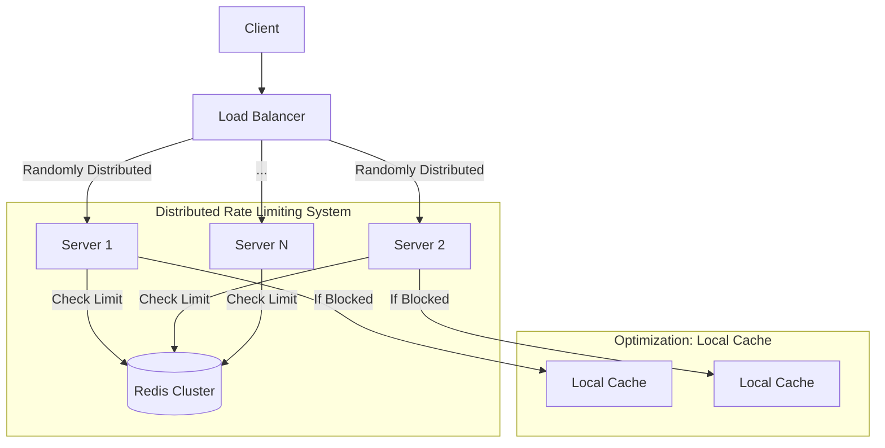

# High-Level Design (HLD)

## Problem Statement
Enforce a rate limit of **100 requests per minute per user** across a cluster of **20 servers** consistently.

## Architecture

## Core Strategy: Centralized State + Local Optimization
1.  **Centralized Truth**: Redis holds the token counters. Since all 20 servers read/write to the same Redis instance (or cluster), the limit is strictly enforced globally.
2.  **Atomicity**: A **Lua Script** runs inside Redis to check and update tokens in a single atomic operation, preventing race conditions (e.g., two servers reading "99" at the same time and both allowing the request).
3.  **Local Optimization (Soft Limits)**: To reduce Redis load, if Redis returns "Blocked for 10s", the server caches this rejection locally. Subsequent requests from that user are rejected instantly by the server memory without hitting Redis.

## Algorithm: Token Bucket
-   **Capacity**: 100 Tokens.
-   **Refill Rate**: 100 tokens / 60 seconds (~1.66 tokens/sec).
-   **Logic**:
    -   Request arrives.
    -   Refill bucket based on time elapsed since last request.
    -   If tokens >= 1, consume 1 and Allow.
    -   Else, Reject and calculate `retry_after`.
