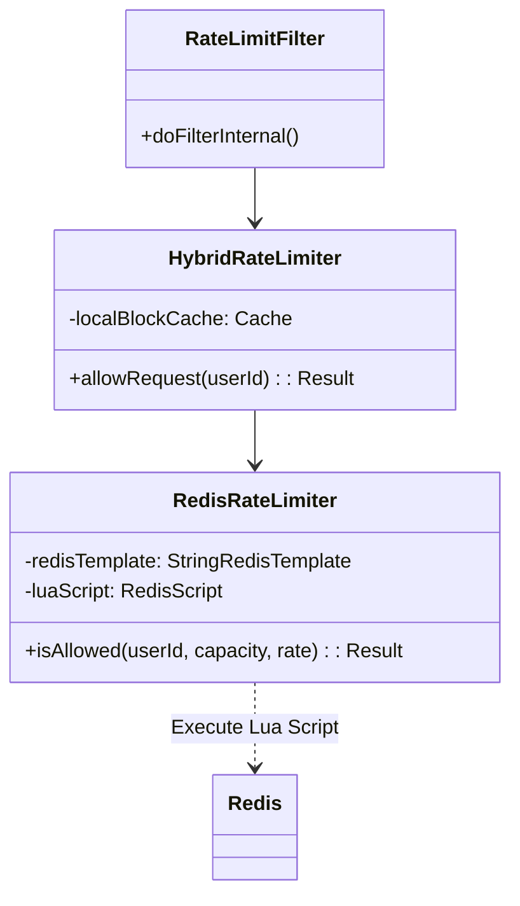

# Low-Level Design (LLD)

## Component Diagram

## Data Flow

1.  **Incoming Request**: `RateLimitFilter` extracts `X-User-Id`.
2.  **L1 Check (Local)**: `HybridRateLimiter` checks `Caffeine` cache.
    -   If `userId` exists and `now < blockedUntil`, return `429` immediately.
3.  **L2 Check (Redis)**: `RedisRateLimiter` executes Lua script.
    -   **Keys**: `rate_limit:{userId}`
    -   **Args**: `Capacity=100`, `Rate=1.66`, `Now=Timestamp`.
    -   **Script Logic**:
        -   Get `tokens` and `last_refill`.
        -   `new_tokens = min(capacity, old_tokens + (now - last_refill) * rate)`.
        -   If `new_tokens >= 1`:
            -   Decrement tokens.
            -   Save to Redis.
            -   Return `ALLOWED`.
        -   Else:
            -   Return `BLOCKED` + `retry_after`.
4.  **Result Handling**:
    -   If `ALLOWED`: Proceed.
    -   If `BLOCKED`: 
        -   Add `userId` -> `now + retry_after` to Local Cache.
        -   Return `429`.

## Redis Lua Script
Located at `src/main/resources/scripts/rate_limiter.lua`.
Ensures that the "Get -> Calculate -> Set" sequence is atomic. No other command can interrupt it.

## Configuration
-   **Capacity**: 100 (Hardcoded in service for demo, configurable via properties).
-   **Refill Rate**: 100/60.
-   **Local Cache TTL**: Dynamic (based on `retry_after`).
