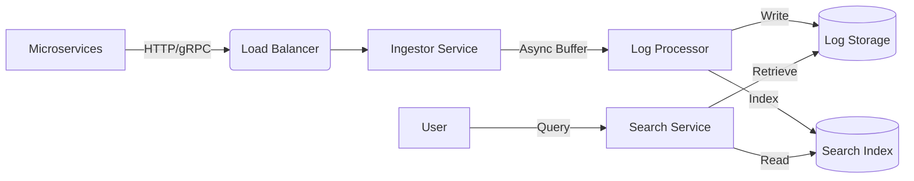

# Distributed Logging System Design

This project demonstrates a simplified implementation of a distributed logging system, similar to components found in the ELK stack (Elasticsearch, Logstash, Kibana) or Splunk.

## High-Level Architecture



## Core Components

1.  **Log Ingestor**:
    -   Exposes a REST API (`POST /api/v1/logs`) to receive log entries from various services.
    -   Validates and enriches logs (e.g., adding timestamps if missing, ingestion time).
    -   Pushes logs to an internal asynchronous buffer (simulating a Message Queue like Kafka).

2.  **Log Processor (Indexer & Storage Engine)**:
    -   Consumes logs from the buffer.
    -   **Storage**: Writes raw logs to append-only files, partitioned by date/hour for efficient rotation and retention management.
    -   **Indexing**: Updates an in-memory Inverted Index (mapping keywords to file offsets) to enable fast full-text search. *Note: In a real system, this would be Lucene/Elasticsearch.*

3.  **Search Service**:
    -   Exposes a REST API (`GET /api/v1/logs?q=error`) to search logs.
    -   Uses the index to find relevant log entries quickly without scanning all files.

## Data Model

**Log Entry:**
```json
{
  "serviceId": "order-service",
  "level": "ERROR",
  "message": "Database connection failed",
  "timestamp": "2023-10-27T10:00:00Z",
  "metadata": { "traceId": "abc-123" }
}
```

## How to Run

1.  Start the application: `mvn spring-boot:run`
2.  Ingest logs via `POST /api/v1/logs`
3.  Search logs via `GET /api/v1/logs?query=...`
