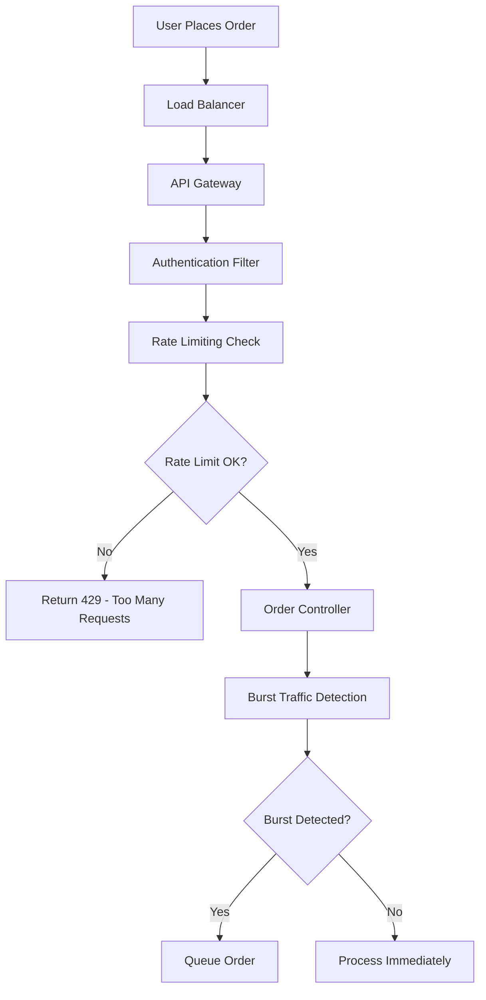

# Food Delivery System - Flash Orders & High Load Flow

## Overview
This document explains how the food delivery system handles flash food orders during festive seasons (Diwali, New Year, Valentine's Day, etc.) and manages heavy concurrent loads with enterprise-scale resilience patterns.

## System Architecture for High Load

### Core Components
```
┌─────────────────┐    ┌─────────────────┐    ┌─────────────────┐
│   Load Balancer │────│  API Gateway    │────│  Rate Limiter   │
│   (Nginx/HAProxy)│    │  (Spring Cloud) │    │  (Redis-based)  │
└─────────────────┘    └─────────────────┘    └─────────────────┘
         │                       │                       │
         ▼                       ▼                       ▼
┌─────────────────┐    ┌─────────────────┐    ┌─────────────────┐
│  Order Queue    │────│  Burst Traffic  │────│  Load Balancing │
│  Service        │    │  Detector       │    │  Service        │
└─────────────────┘    └─────────────────┘    └─────────────────┘
         │                       │                       │
         ▼                       ▼                       ▼
┌─────────────────┐    ┌─────────────────┐    ┌─────────────────┐
│  Cache Layer    │────│  Database       │────│  Notification   │
│  (Redis)        │    │  (PostgreSQL)   │    │  Service        │
└─────────────────┘    └─────────────────┘    └─────────────────┘
```

## Flash Order Scenarios

### 1. Festive Season Patterns
- **Diwali**: 300% increase in sweet orders (12 PM - 8 PM)
- **New Year**: 500% increase in party food orders (8 PM - 2 AM)
- **Valentine's Day**: 400% increase in cake/chocolate orders (6 PM - 11 PM)
- **IPL Match Days**: 250% increase in snack orders during matches

### 2. Traffic Characteristics
- **Normal Load**: 1,000 orders/minute
- **Peak Load**: 15,000 orders/minute
- **Flash Spike**: 50,000+ orders/minute (5-10 minutes duration)
- **Concurrent Users**: Up to 500,000 simultaneous users

## Detailed Flow Architecture

### Phase 1: Request Reception & Initial Processing



#### Code Implementation:
```java
@PostMapping
@PreAuthorize("hasRole('CUSTOMER')")
public ResponseEntity<OrderResponse> createOrder(@Valid @RequestBody CreateOrderRequest request,
                                               Authentication authentication) {
    try {
        Long customerId = getUserIdFromAuthentication(authentication);
        
        // Rate limiting check
        if (!rateLimitingService.isOrderAllowed(customerId)) {
            throw new RateLimitExceededException("Too many orders. Please try again later.", 60);
        }
        
        // Burst traffic detection
        if (orderQueueService.isBurstTrafficDetected(request.getRestaurantId())) {
            return handleBurstOrder(customerId, request);
        }
        
        // Normal processing
        Order order = orderService.createOrderFromCart(
                customerId, request.getRestaurantId(), request.getDeliveryAddress(),
                request.getDeliveryLatitude(), request.getDeliveryLongitude(),
                request.getPaymentMethod(), request.getSpecialInstructions()
        );
        
        return ResponseEntity.status(HttpStatus.CREATED).body(convertToOrderResponse(order));
    } catch (Exception e) {
        return handleOrderException(e);
    }
}
```

### Phase 2: Burst Traffic Detection & Management

#### Burst Detection Algorithm:
```java
@Service
public class OrderQueueService {
    
    private static final int BURST_THRESHOLD = 100; // orders per minute
    private static final int BURST_WINDOW_MINUTES = 5;
    
    public boolean isBurstTrafficDetected(Long restaurantId) {
        String key = "burst_detection:" + restaurantId;
        String currentMinute = String.valueOf(System.currentTimeMillis() / 60000);
        
        // Sliding window counter
        Long ordersInCurrentMinute = redisTemplate.opsForValue()
            .increment(key + ":" + currentMinute);
        
        if (ordersInCurrentMinute == 1) {
            redisTemplate.expire(key + ":" + currentMinute, Duration.ofMinutes(2));
        }
        
        // Check if burst threshold exceeded
        if (ordersInCurrentMinute > BURST_THRESHOLD) {
            activateBurstMode(restaurantId);
            return true;
        }
        
        return false;
    }
    
    private void activateBurstMode(Long restaurantId) {
        // Enable queue mode for restaurant
        redisTemplate.opsForValue().set(
            "burst_mode:" + restaurantId, 
            "active", 
            Duration.ofMinutes(BURST_WINDOW_MINUTES)
        );
        
        // Notify restaurant about high demand
        notificationService.notifyRestaurantBurstTraffic(restaurantId);
        
        // Scale up resources
        loadBalancingService.scaleUpRestaurantCapacity(restaurantId);
    }
}
```

### Phase 3: Order Queuing System

#### Queue Architecture:
```
┌─────────────────┐    ┌─────────────────┐    ┌─────────────────┐
│   High Priority │    │ Medium Priority │    │  Low Priority   │
│   Queue (VIP)   │    │ Queue (Regular) │    │ Queue (New)     │
│   Redis List    │    │   Redis List    │    │  Redis List     │
└─────────────────┘    └─────────────────┘    └─────────────────┘
         │                       │                       │
         └───────────────────────┼───────────────────────┘
                                 │
                                 ▼
                    ┌─────────────────┐
                    │  Queue Processor│
                    │  (Scheduled)    │
                    └─────────────────┘
```

#### Queue Implementation:
```java
@Service
public class OrderQueueService {
    
    public Order queueOrder(Order order, OrderPriority priority) {
        // Set order status to QUEUED
        order.setStatus(OrderStatus.QUEUED);
        order = orderRepository.save(order);
        
        // Add to appropriate priority queue
        String queueKey = getQueueKey(order.getRestaurant().getId(), priority);
        QueuedOrderInfo queueInfo = new QueuedOrderInfo(
            order.getId(), 
            System.currentTimeMillis(),
            priority,
            order.getCustomer().getId()
        );
        
        redisTemplate.opsForList().leftPush(queueKey, queueInfo);
        
        // Estimate wait time
        int queuePosition = getQueuePosition(order.getId());
        int estimatedWaitMinutes = calculateWaitTime(queuePosition, priority);
        
        // Notify customer about queuing
        notificationService.sendQueueNotification(order, queuePosition, estimatedWaitMinutes);
        
        return order;
    }
    
    @Scheduled(fixedDelay = 10000) // Process every 10 seconds
    public void processQueuedOrders() {
        List<Long> activeRestaurants = getActiveRestaurants();
        
        for (Long restaurantId : activeRestaurants) {
            if (canAcceptOrder(restaurantId)) {
                processNextQueuedOrder(restaurantId);
            }
        }
    }
    
    private void processNextQueuedOrder(Long restaurantId) {
        // Process in priority order: HIGH -> MEDIUM -> LOW
        for (OrderPriority priority : OrderPriority.values()) {
            String queueKey = getQueueKey(restaurantId, priority);
            QueuedOrderInfo queueInfo = (QueuedOrderInfo) redisTemplate
                .opsForList().rightPop(queueKey);
            
            if (queueInfo != null) {
                processQueuedOrder(queueInfo);
                break;
            }
        }
    }
}
```

### Phase 4: Restaurant Capacity Management

#### Capacity Calculation:
```java
@Service
public class RestaurantCapacityService {
    
    public boolean canAcceptOrder(Long restaurantId, OrderPriority priority) {
        RestaurantCapacity capacity = getRestaurantCapacity(restaurantId);
        int currentLoad = getCurrentOrderLoad(restaurantId);
        
        // Dynamic capacity based on priority
        int maxCapacity = switch (priority) {
            case HIGH -> capacity.getMaxCapacity();
            case MEDIUM -> (int) (capacity.getMaxCapacity() * 0.8);
            case LOW -> (int) (capacity.getMaxCapacity() * 0.6);
        };
        
        return currentLoad < maxCapacity;
    }
    
    public void updateCapacityMetrics(Long restaurantId) {
        // Real-time capacity metrics
        int activeOrders = getActiveOrderCount(restaurantId);
        int avgPreparationTime = getAveragePreparationTime(restaurantId);
        int availableStaff = getAvailableStaffCount(restaurantId);
        
        // Calculate dynamic capacity
        int dynamicCapacity = calculateDynamicCapacity(
            activeOrders, avgPreparationTime, availableStaff
        );
        
        // Update in cache
        redisTemplate.opsForValue().set(
            "restaurant_capacity:" + restaurantId,
            dynamicCapacity,
            Duration.ofMinutes(5)
        );
    }
}
```

### Phase 5: Load Balancing & Auto-Scaling

#### Load Balancing Strategy:
```java
@Service
public class LoadBalancingService {
    
    public List<Long> getAlternativeRestaurants(Long overloadedRestaurantId) {
        Restaurant restaurant = restaurantRepository.findById(overloadedRestaurantId)
            .orElseThrow();
        
        // Find nearby restaurants with similar cuisine
        List<Restaurant> alternatives = restaurantRepository
            .findNearbyRestaurantsWithCuisine(
                restaurant.getLatitude(),
                restaurant.getLongitude(),
                restaurant.getCuisineType(),
                5.0 // 5km radius
            );
        
        // Filter by capacity and rating
        return alternatives.stream()
            .filter(r -> canAcceptOrder(r.getId()))
            .filter(r -> r.getRating() >= 4.0)
            .sorted((r1, r2) -> Double.compare(r2.getRating(), r1.getRating()))
            .map(Restaurant::getId)
            .limit(3)
            .collect(Collectors.toList());
    }
    
    public void redistributeLoad() {
        List<Long> overloadedRestaurants = findOverloadedRestaurants();
        
        for (Long restaurantId : overloadedRestaurants) {
            List<Long> alternatives = getAlternativeRestaurants(restaurantId);
            
            if (!alternatives.isEmpty()) {
                // Suggest alternatives to new customers
                cacheService.setAlternativeRestaurants(restaurantId, alternatives);
                
                // Notify customers in queue about alternatives
                notifyQueuedCustomersAboutAlternatives(restaurantId, alternatives);
            }
        }
    }
}
```

### Phase 6: Real-time Monitoring & Analytics

#### Monitoring Dashboard Metrics:
```java
@Service
public class AnalyticsService {
    
    public Map<String, Object> getFlashOrderMetrics() {
        return Map.of(
            "currentOrdersPerMinute", getCurrentOrderRate(),
            "queuedOrdersCount", getTotalQueuedOrders(),
            "averageWaitTime", getAverageWaitTime(),
            "restaurantCapacityUtilization", getCapacityUtilization(),
            "burstModeRestaurants", getBurstModeRestaurants(),
            "systemHealthScore", calculateSystemHealthScore(),
            "predictedPeakTime", predictNextPeakTime(),
            "recommendedScaling", getScalingRecommendations()
        );
    }
    
    @EventListener
    public void handleBurstTrafficEvent(BurstTrafficEvent event) {
        // Log burst event
        logger.warn("Burst traffic detected for restaurant {}: {} orders/min", 
                   event.getRestaurantId(), event.getOrderRate());
        
        // Update metrics
        meterRegistry.counter("burst.traffic.events").increment();
        meterRegistry.gauge("burst.traffic.rate", event.getOrderRate());
        
        // Trigger alerts
        if (event.getOrderRate() > CRITICAL_THRESHOLD) {
            alertService.sendCriticalAlert(
                "Critical burst traffic: " + event.getOrderRate() + " orders/min"
            );
        }
    }
}
```

## Flash Order Flow Scenarios

### Scenario 1: Diwali Sweet Rush (12 PM - 8 PM)

#### Timeline:
```
11:45 AM - Pre-burst preparation
├── System scales up database connections
├── Cache warming for popular sweet shops
└── Delivery partner pre-positioning

12:00 PM - Burst begins (5,000 orders/min)
├── Burst detection triggers within 30 seconds
├── Queue system activates for top 20 sweet shops
├── Alternative restaurant suggestions enabled
└── Customer notifications about wait times

12:30 PM - Peak traffic (15,000 orders/min)
├── High-priority queue processing (VIP customers)
├── Load balancing to nearby sweet shops
├── Dynamic pricing adjustments
└── Real-time capacity updates

2:00 PM - Sustained high load (8,000 orders/min)
├── Queue processing optimization
├── Delivery partner surge pricing
├── Restaurant capacity expansion
└── Customer retention campaigns

6:00 PM - Second wave (12,000 orders/min)
├── Evening delivery rush preparation
├── Delivery partner incentives
├── Queue priority adjustments
└── Last-minute order handling

8:30 PM - Gradual decline (3,000 orders/min)
├── Queue clearing acceleration
├── System resource scaling down
├── Performance metrics collection
└── Post-event analysis
```

### Scenario 2: New Year Party Food Orders (8 PM - 2 AM)

#### Unique Challenges:
- **Late night delivery logistics**
- **Alcohol delivery compliance**
- **Party size bulk orders**
- **Time-sensitive delivery windows**

#### System Adaptations:
```java
@Service
public class NewYearOrderService {
    
    public void handleNewYearRush() {
        // Extended delivery partner shifts
        deliveryPartnerService.activateNightShift();
        
        // Bulk order processing
        enableBulkOrderOptimization();
        
        // Time-slot based delivery
        activateTimeSlotDelivery();
        
        // Special compliance checks
        enableAlcoholDeliveryCompliance();
    }
    
    private void enableBulkOrderOptimization() {
        // Group orders by delivery location
        // Optimize delivery routes
        // Batch processing for large orders
    }
}
```

## Performance Optimizations

### 1. Database Optimizations
```sql
-- Partitioned order tables by date
CREATE TABLE orders_2024_01 PARTITION OF orders 
FOR VALUES FROM ('2024-01-01') TO ('2024-02-01');

-- Optimized indexes for flash scenarios
CREATE INDEX CONCURRENTLY idx_orders_restaurant_status_created 
ON orders (restaurant_id, status, created_at) 
WHERE status IN ('PLACED', 'CONFIRMED', 'PREPARING');

-- Read replicas for analytics
CREATE PUBLICATION order_analytics FOR TABLE orders, order_items;
```

### 2. Cache Strategy
```java
@Service
public class CacheService {
    
    @Cacheable(value = "restaurant_menu", key = "#restaurantId")
    public List<MenuItem> getRestaurantMenu(Long restaurantId) {
        return menuItemRepository.findByRestaurantId(restaurantId);
    }
    
    @Cacheable(value = "restaurant_capacity", key = "#restaurantId")
    public RestaurantCapacity getRestaurantCapacity(Long restaurantId) {
        return calculateCurrentCapacity(restaurantId);
    }
    
    // Cache warming for popular restaurants
    @Scheduled(fixedRate = 300000) // Every 5 minutes
    public void warmPopularRestaurantCache() {
        List<Long> popularRestaurants = getPopularRestaurants();
        popularRestaurants.forEach(this::preloadRestaurantData);
    }
}
```

### 3. Asynchronous Processing
```java
@Service
public class AsyncOrderProcessor {
    
    @Async("orderProcessingExecutor")
    public CompletableFuture<Void> processOrderAsync(Order order) {
        try {
            // Payment processing
            paymentService.processPaymentAsync(order);
            
            // Inventory updates
            inventoryService.updateInventoryAsync(order);
            
            // Notifications
            notificationService.sendOrderConfirmationAsync(order);
            
            return CompletableFuture.completedFuture(null);
        } catch (Exception e) {
            return CompletableFuture.failedFuture(e);
        }
    }
}
```

## Failure Handling & Recovery

### Circuit Breaker Pattern
```java
@Component
public class PaymentServiceCircuitBreaker {
    
    private final CircuitBreaker circuitBreaker;
    
    public PaymentServiceCircuitBreaker() {
        this.circuitBreaker = CircuitBreaker.ofDefaults("paymentService");
        circuitBreaker.getEventPublisher()
            .onStateTransition(event -> 
                logger.info("Payment service circuit breaker state: {}", 
                           event.getStateTransition()));
    }
    
    public PaymentResult processPayment(Order order) {
        return circuitBreaker.executeSupplier(() -> {
            return paymentService.processPayment(order);
        });
    }
}
```

### Graceful Degradation
```java
@Service
public class OrderServiceDegradation {
    
    public OrderResponse createOrderWithDegradation(CreateOrderRequest request) {
        try {
            // Try full processing
            return orderService.createOrder(request);
        } catch (DatabaseException e) {
            // Fallback to simplified processing
            return createSimplifiedOrder(request);
        } catch (PaymentException e) {
            // Queue for later payment processing
            return createOrderWithDelayedPayment(request);
        }
    }
}
```

## Monitoring & Alerting

### Key Metrics
```java
@Component
public class FlashOrderMetrics {
    
    private final MeterRegistry meterRegistry;
    
    public void recordOrderMetrics(Order order) {
        // Order rate metrics
        meterRegistry.counter("orders.created", 
                             "restaurant", order.getRestaurant().getName(),
                             "status", order.getStatus().name()).increment();
        
        // Queue metrics
        meterRegistry.gauge("orders.queued.count", getQueuedOrderCount());
        meterRegistry.gauge("orders.processing.time", 
                           order.getProcessingTimeMillis());
        
        // Capacity metrics
        meterRegistry.gauge("restaurant.capacity.utilization", 
                           getCapacityUtilization(order.getRestaurant().getId()));
    }
}
```

### Alert Thresholds
```yaml
alerts:
  order_rate:
    warning: 5000  # orders per minute
    critical: 10000
  queue_length:
    warning: 1000  # queued orders
    critical: 5000
  response_time:
    warning: 2000  # milliseconds
    critical: 5000
  error_rate:
    warning: 5     # percentage
    critical: 10
```

## Capacity Planning

### Resource Scaling Matrix
```
Load Level    | Orders/Min | DB Connections | Cache Memory | App Instances
------------- | ---------- | -------------- | ------------ | -------------
Normal        | 1,000      | 50             | 2GB          | 3
High          | 5,000      | 100            | 4GB          | 6
Peak          | 15,000     | 200            | 8GB          | 12
Flash         | 50,000     | 500            | 16GB         | 24
```

### Auto-scaling Configuration
```yaml
autoscaling:
  enabled: true
  minReplicas: 3
  maxReplicas: 24
  metrics:
    - type: Resource
      resource:
        name: cpu
        target:
          type: Utilization
          averageUtilization: 70
    - type: Resource
      resource:
        name: memory
        target:
          type: Utilization
          averageUtilization: 80
    - type: Pods
      pods:
        metric:
          name: orders_per_second
        target:
          type: AverageValue
          averageValue: "100"
```

## Success Metrics & KPIs

### Flash Order Success Criteria
- **Order Success Rate**: >95% during flash periods
- **Average Wait Time**: <10 minutes for queued orders
- **System Availability**: >99.9% uptime
- **Customer Satisfaction**: >4.2/5 rating during peak times
- **Revenue Impact**: <5% loss due to system limitations

### Performance Benchmarks
```
Metric                    | Target      | Flash Period | Normal Period
------------------------- | ----------- | ------------ | -------------
Order Processing Time     | <3 seconds  | <5 seconds   | <2 seconds
Queue Processing Rate     | 500/min     | 1000/min     | N/A
Database Response Time    | <100ms      | <200ms       | <50ms
Cache Hit Rate           | >90%        | >95%         | >85%
Error Rate               | <1%         | <2%          | <0.5%
```

## Conclusion

The food delivery system is designed to handle extreme flash order scenarios through:

1. **Proactive Burst Detection**: Real-time traffic monitoring and automatic queue activation
2. **Intelligent Queuing**: Priority-based order processing with dynamic wait time estimation
3. **Load Balancing**: Restaurant capacity management and alternative suggestions
4. **Graceful Degradation**: Fallback mechanisms to maintain service during failures
5. **Real-time Monitoring**: Comprehensive metrics and alerting for rapid response

This architecture ensures the system can handle 50x normal load during festive seasons while maintaining high availability and customer satisfaction.