# Food Delivery System - Complete Flow Documentation

## 🔄 **System Architecture Flow**

```
┌─────────────────┐    ┌─────────────────┐    ┌─────────────────┐
│   Mobile App    │    │   Web Client    │    │  Admin Panel    │
└─────────────────┘    └─────────────────┘    └─────────────────┘
         │                       │                       │
         └───────────────────────┼───────────────────────┘
                                 │
         ┌─────────────────────────────────────────────────┐
         │              Load Balancer                      │
         └─────────────────────────────────────────────────┘
                                 │
         ┌─────────────────────────────────────────────────┐
         │              Rate Limiter                       │
         │        (Bucket4j + Redis)                       │
         └─────────────────────────────────────────────────┘
                                 │
         ┌─────────────────────────────────────────────────┐
         │           Spring Boot Application               │
         │  ┌─────────────┐  ┌─────────────┐  ┌──────────┐ │
         │  │ Controllers │  │  Services   │  │   Cache  │ │
         │  └─────────────┘  └─────────────┘  └──────────┘ │
         └─────────────────────────────────────────────────┘
                                 │
    ┌────────────────────────────┼────────────────────────────┐
    │                            │                            │
┌───▼────┐              ┌───────▼────┐              ┌────▼────┐
│PostgreSQL│              │   Redis    │              │  Kafka  │
│Database  │              │   Cache    │              │Messaging│
└──────────┘              └────────────┘              └─────────┘
```

## 📱 **User Journey Flows**

### **1. Customer Order Flow**

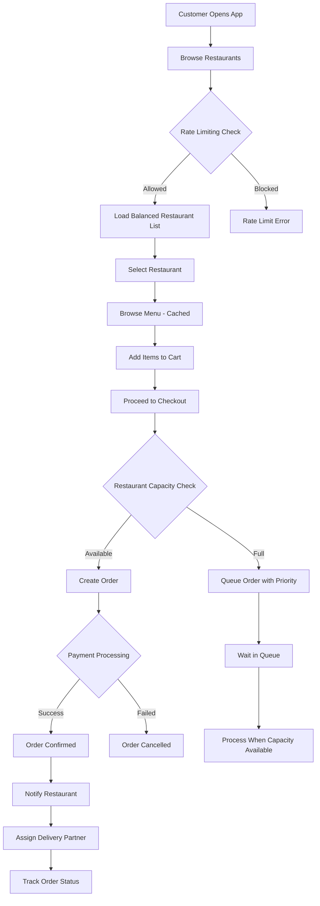

### **2. Restaurant Order Processing Flow**

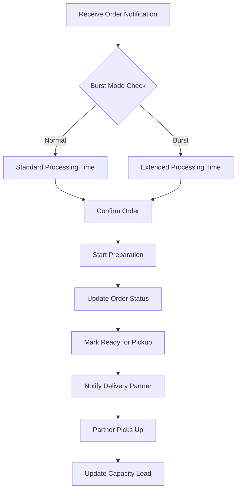

### **3. Delivery Partner Flow**

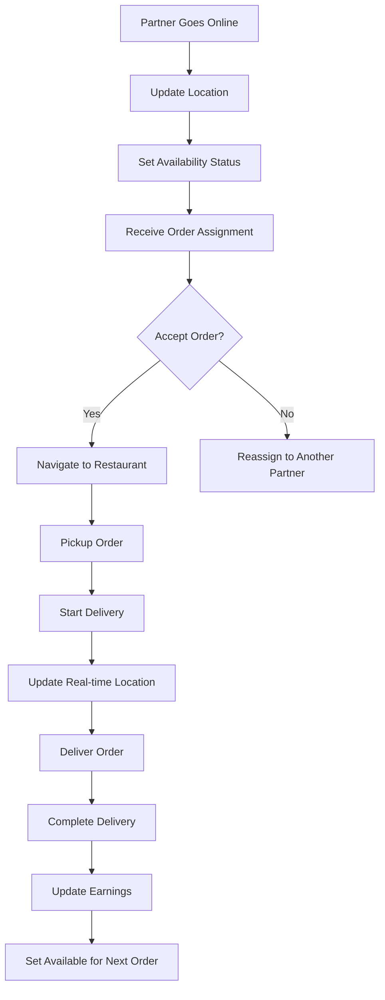

## 🚀 **High-Traffic Scenarios Flow**

### **Burst Traffic Handling**

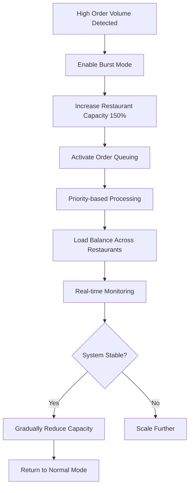

### **Order Queue Processing**

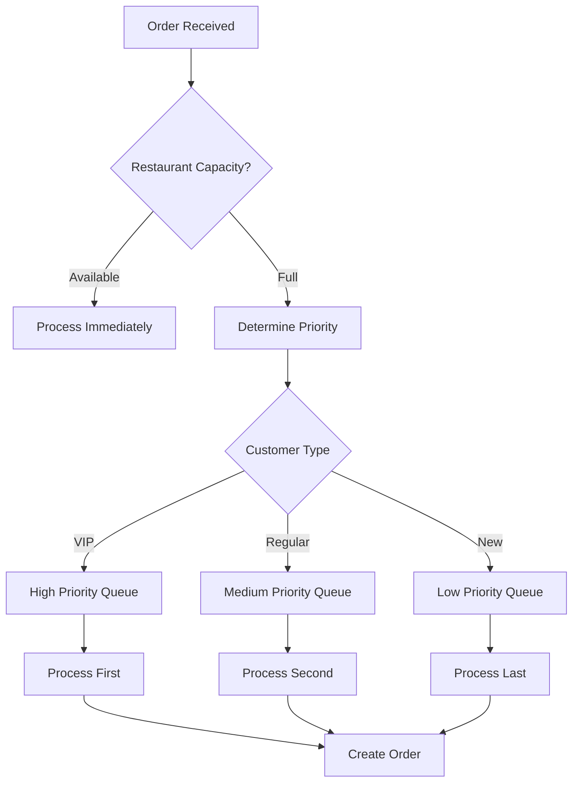

## 🔧 **Technical Flow Details**

### **Caching Strategy Flow**

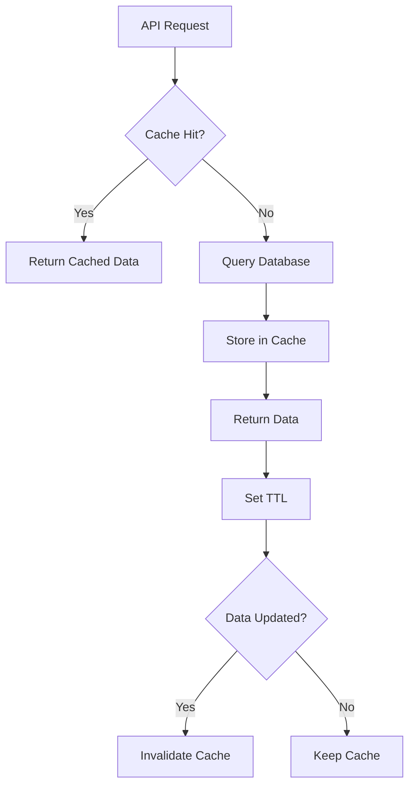

### **Payment Processing Flow**

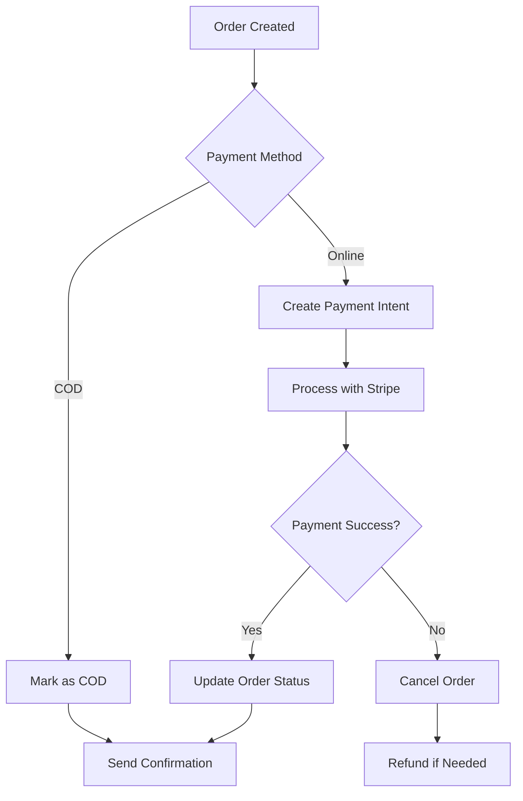

### **Real-time Analytics Flow**

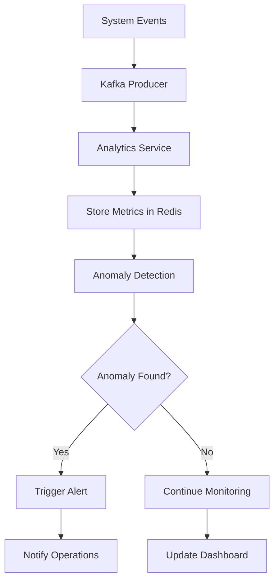

## 📊 **Data Flow Architecture**

### **Database Operations**

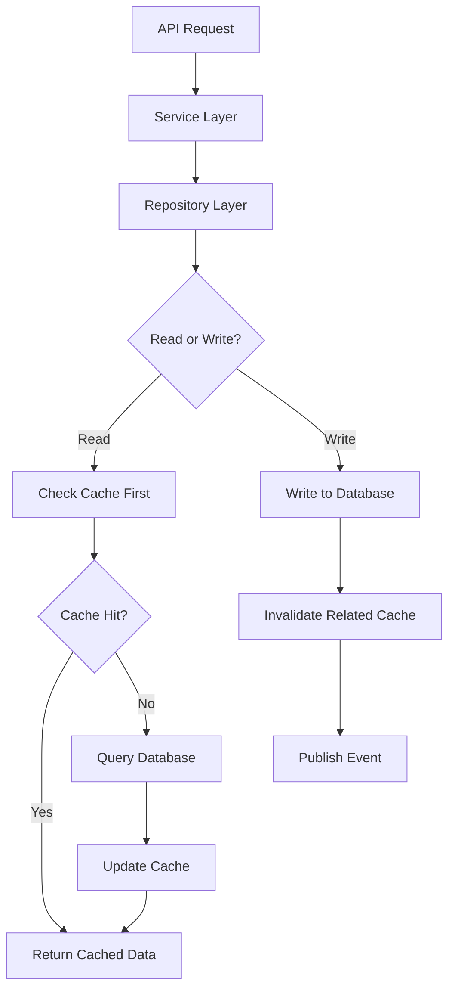

### **Event-Driven Architecture**

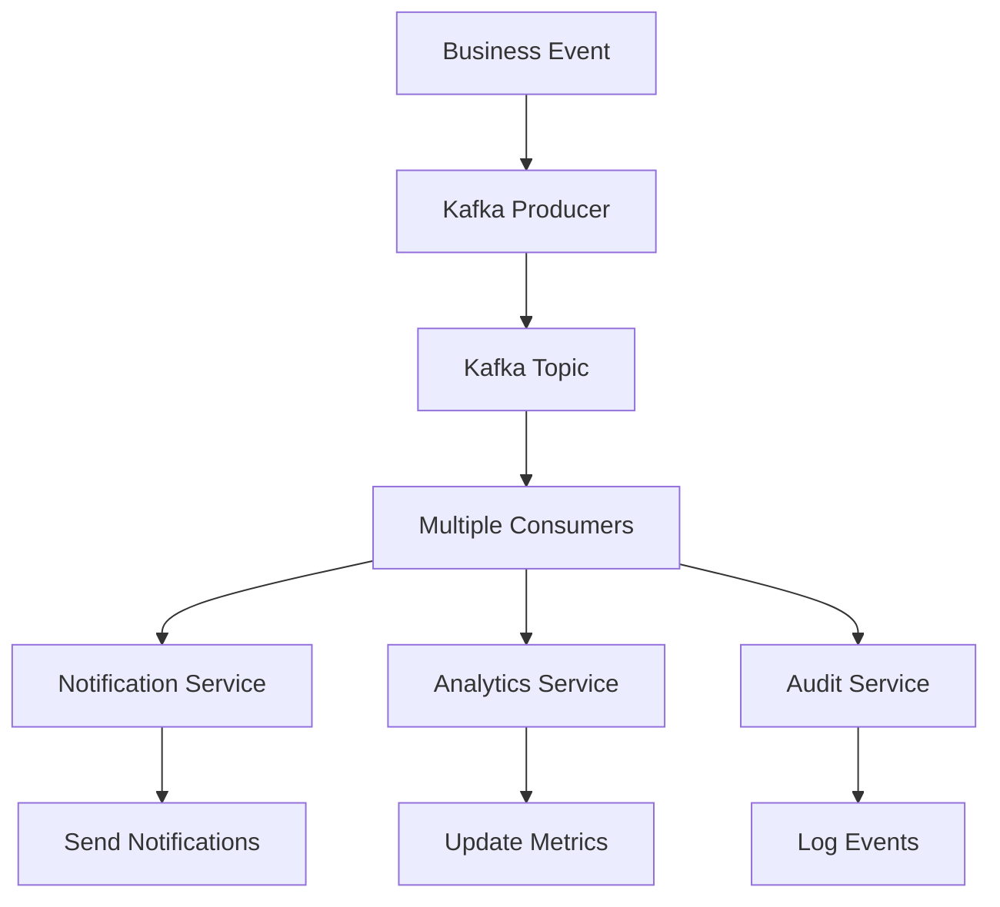

## 🔄 **Background Processing Flow**

### **Scheduled Tasks**

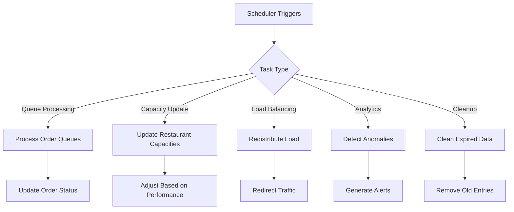

## 🚨 **Error Handling Flow**

### **Circuit Breaker Pattern**

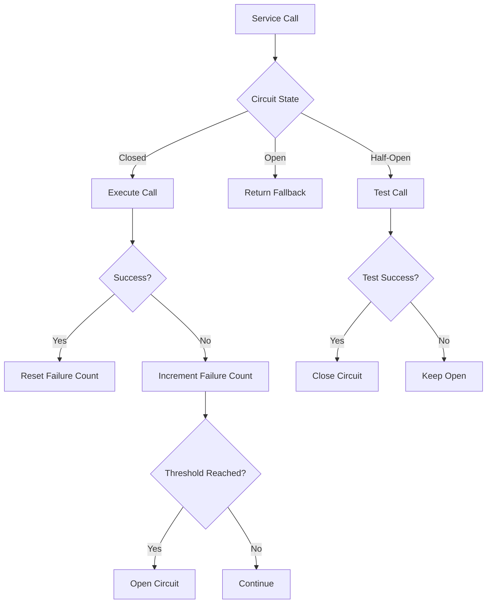

## 📈 **Performance Optimization Flow**

### **Load Balancing Algorithm**

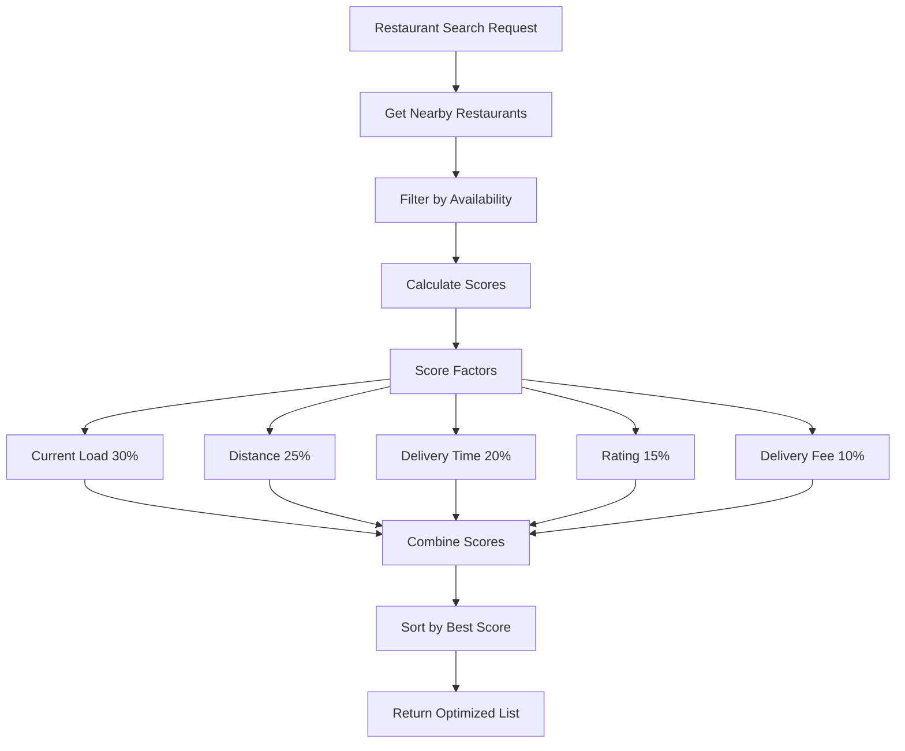

## 🔐 **Security Flow**

### **Authentication & Authorization**

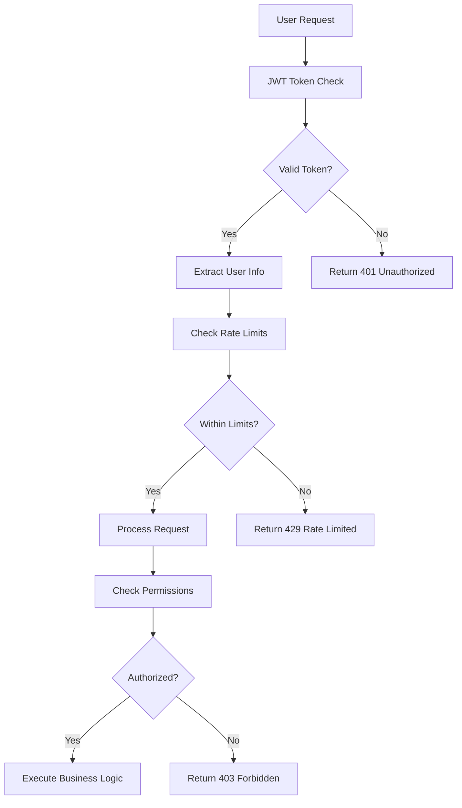

## 📱 **Mobile App Integration Flow**

### **Real-time Updates**

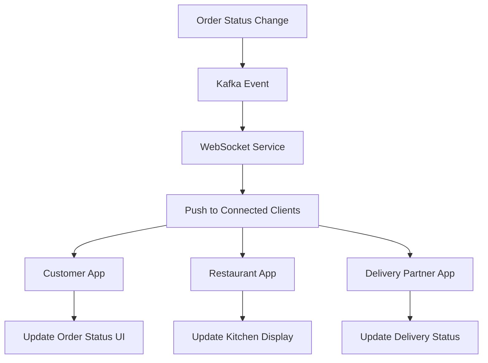

## 🎯 **Key Performance Indicators (KPIs)**

### **Monitoring Metrics Flow**

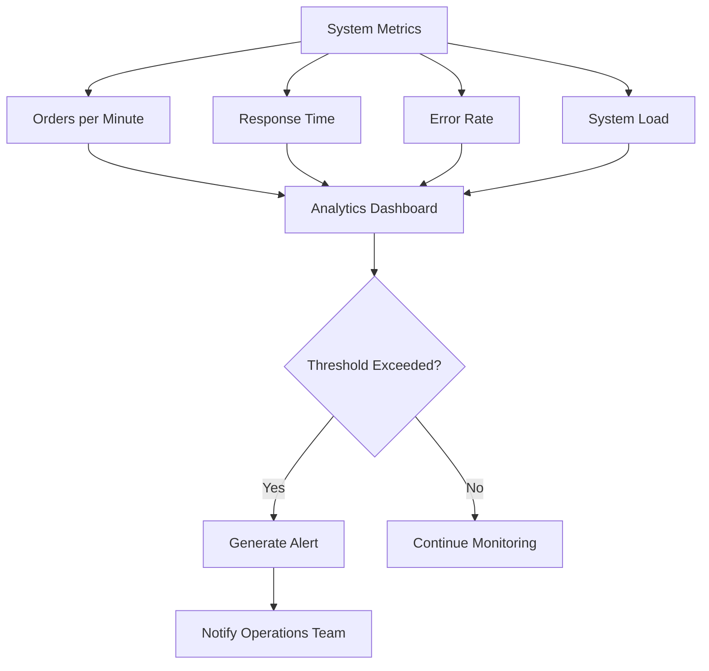

## 🔄 **Deployment Flow**

### **CI/CD Pipeline**

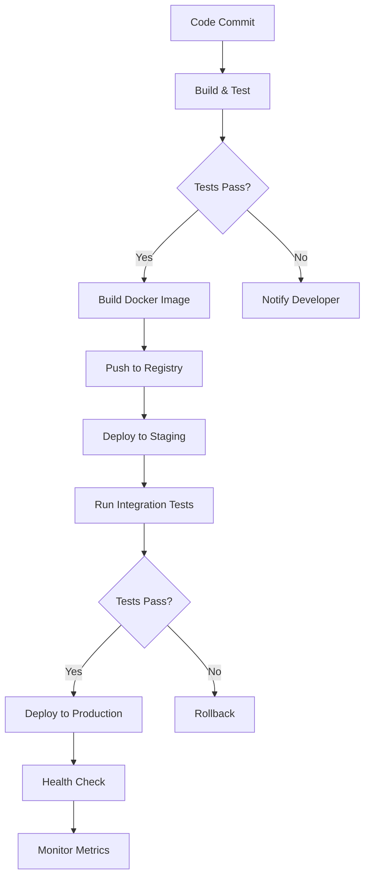

This comprehensive flow documentation covers all aspects of the food delivery system, from user interactions to technical implementation details, ensuring a complete understanding of how the system handles various scenarios including high-traffic situations.