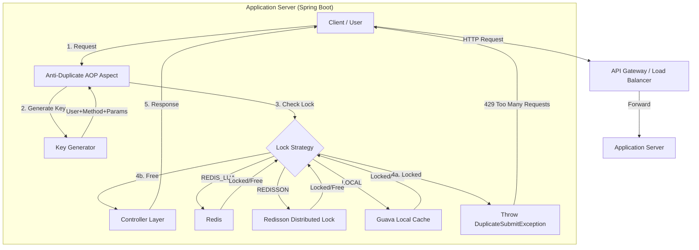

# High-Level Design (HLD) - Interface Anti-Shake & Anti-Duplicate System

## 1. Introduction
The **Interface Anti-Shake and Anti-Duplicate System** is a middleware solution designed to prevent duplicate submissions of API requests within a short time window. This is critical for maintaining data integrity in scenarios like order submission, payment processing, and high-frequency user interactions.

## 2. Problem Statement
In web applications, users may accidentally double-click buttons, or network latency might cause clients to retry requests. Malicious scripts can also spam APIs. Without protection, this leads to:
*   Duplicate database records.
*   Inconsistent system state (e.g., double charging).
*   Unnecessary server load.

## 3. System Architecture

The system is implemented as a **Spring Boot Starter** style module (integrated via AOP) that sits between the Client and the Controller.

### 3.1 Architectural Diagram

## 4. Key Components

### 4.1 Request Interceptor (AOP Aspect)
*   **Role**: Intercepts methods annotated with `@AntiDuplicateSubmit`.
*   **Responsibility**: 
    1.  Parse method arguments and user identity.
    2.  Generate a unique "Request Key".
    3.  Delegate lock acquisition to the chosen strategy.

### 4.2 Lock Strategies
The system supports three locking mechanisms to adapt to different infrastructure needs:

| Strategy | Technology | Scope | Pros | Cons |
| :--- | :--- | :--- | :--- | :--- |
| **REDIS_LUA** | Redis + Lua Script | Distributed | Atomic, Lightweight, High Performance | Requires Redis |
| **REDISSON** | Redisson | Distributed | Robust, Production-grade, Watchdog support | Heavier dependency |
| **LOCAL** | Guava Cache | Single Node | Zero dependency, Fastest | No distributed protection |

### 4.3 Key Generation Policy
To uniquely identify a "duplicate" request, the key is constructed as:
`anti_dup:{UserId}:{ClassName}:{MethodName}:{MD5(Params)}`

*   **UserId**: Extracted from `Authorization` header or IP address.
*   **Params**: Full JSON body or query parameters hashed via MD5.

## 5. Data Flow

1.  **Incoming Request**: User sends a POST request to `/api/submit`.
2.  **Interception**: Aspect captures the call before entering the controller.
3.  **Key Generation**: Aspect creates a unique hash for the request.
4.  **Lock Acquisition**:
    *   System attempts to set this key in the storage (Redis/Local) with a TTL (e.g., 5 seconds).
    *   **Success**: If key didn't exist, lock is acquired. Proceed to Controller.
    *   **Failure**: If key exists, it means a request was made < 5s ago. Throw Exception.
5.  **Execution**: Controller logic runs (if lock acquired).
6.  **Response**: Result returned to user.

## 6. Non-Functional Requirements
*   **Performance**: Overhead must be < 10ms per request.
*   **Availability**: Redis downtime should gracefully degrade (fail-open or fail-closed based on config, currently fail-closed).
*   **Scalability**: Must support horizontal scaling (via Redis strategies).
