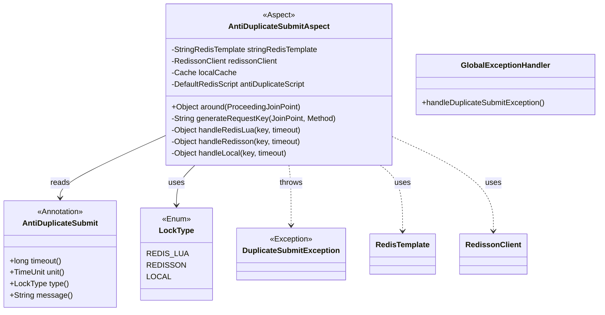
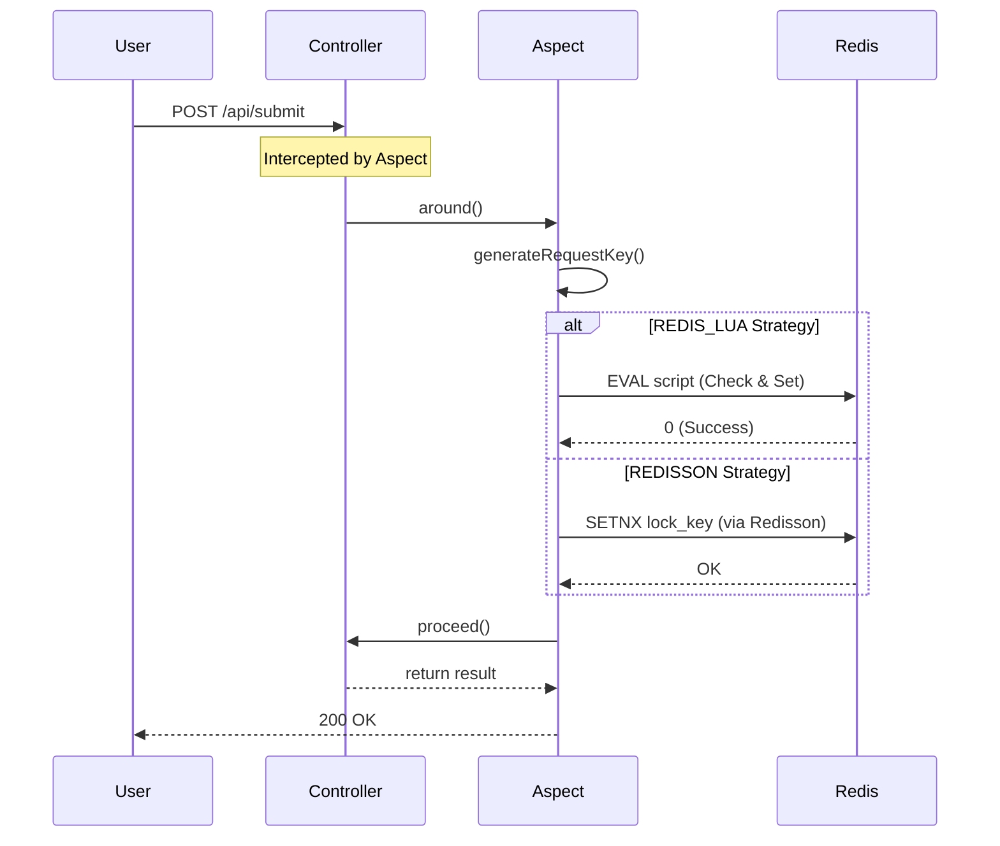
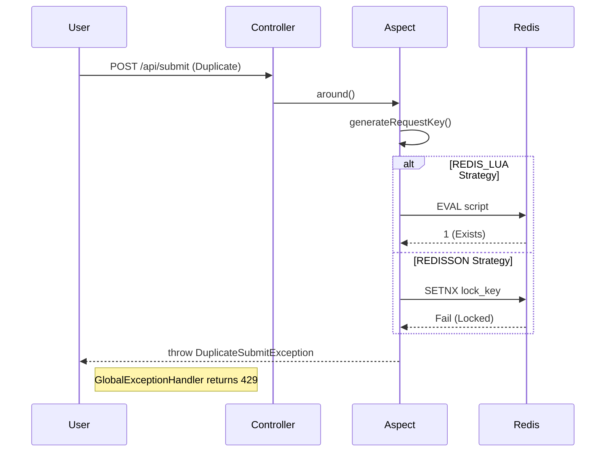

# Low-Level Design (LLD) - Interface Anti-Shake & Anti-Duplicate System

## 1. Class Design

The core logic is encapsulated within the `com.example.antishake` package.

### 1.1 Class Diagram



## 2. Component Details

### 2.1 Annotation: `@AntiDuplicateSubmit`
*   **Target**: `ElementType.METHOD`
*   **Retention**: `RetentionPolicy.RUNTIME`
*   **Attributes**:
    *   `timeout`: Lock duration (default 1).
    *   `unit`: Time unit (default SECONDS).
    *   `type`: Strategy selection (default REDIS_LUA).

### 2.2 Aspect: `AntiDuplicateSubmitAspect`

#### 2.2.1 Key Generation Logic (`generateRequestKey`)
```java
String userId = request.getHeader("Authorization") ?? request.getRemoteAddr();
String className = method.getDeclaringClass().getName();
String methodName = method.getName();
String paramsDigest = MD5(Arrays.toString(args));
return "anti_dup:" + userId + ":" + className + ":" + methodName + ":" + paramsDigest;
```

#### 2.2.2 Strategy Implementation

**A. Redis Lua Strategy**
*   **Script**: `src/main/resources/lua/anti_duplicate_submit.lua`
*   **Logic**:
    ```lua
    if redis.call('EXISTS', key) == 1 then
        return 1 -- Locked
    else
        redis.call('SET', key, '1', 'EX', timeout)
        return 0 -- Success
    end
    ```
*   **Java Execution**: `stringRedisTemplate.execute(script, keys, args)`

**B. Redisson Strategy**
*   **Logic**:
    ```java
    RLock lock = redissonClient.getLock("lock:" + key);
    // tryLock(waitTime=0, leaseTime=timeout)
    if (lock.tryLock(0, timeout, unit)) {
        return proceed();
    } else {
        throw exception;
    }
    ```
    *Note*: We do NOT unlock explicitly. The lock auto-expires after `timeout` to ensure the anti-shake window persists even if execution finishes early.

**C. Local Strategy**
*   **Storage**: `com.google.common.cache.Cache` (Guava).
*   **Logic**:
    ```java
    if (localCache.getIfPresent(key) != null) throw exception;
    localCache.put(key, expireAt);
    return proceed();
    ```

## 3. Sequence Diagram (Success Case)



## 4. Sequence Diagram (Duplicate/Blocked Case)



## 5. Error Handling
*   **Exception**: `DuplicateSubmitException` (Runtime).
*   **Handler**: `GlobalExceptionHandler` catches this exception.
*   **Response**: HTTP 429 Too Many Requests.
    ```json
    {
        "code": 429,
        "message": "Request is too frequent..."
    }
    ```

## 6. Configuration
*   **Redis**: Configured via `spring.data.redis.*` in `application.properties`.
*   **Redisson**: Auto-configured via `redisson-spring-boot-starter`.
