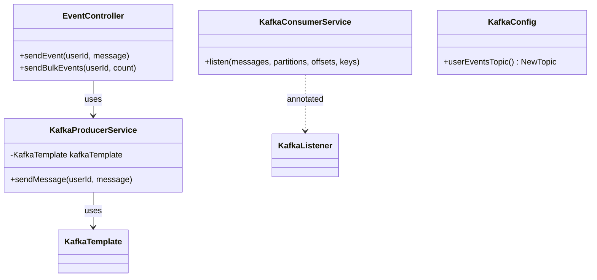
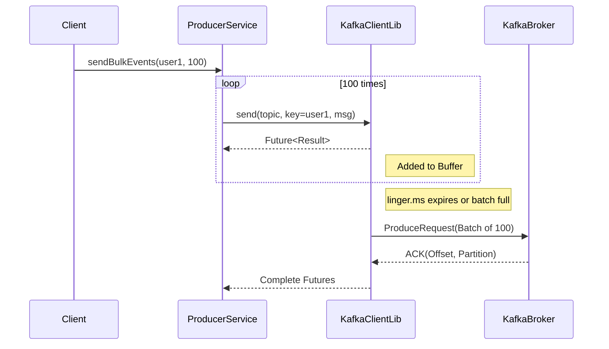

# Low-Level Design (LLD)

## Class Diagram

## Sequence Diagram: Batch Sending

## Component Details

### 1. Producer Configuration (`application.properties`)

| Property | Value | Description |
| :--- | :--- | :--- |
| `spring.kafka.producer.batch-size` | `16384` | Default batch size in bytes (16KB). |
| `spring.kafka.producer.properties.linger.ms` | `10` | Wait time (ms) to group messages before sending. |
| `spring.kafka.producer.key-serializer` | `StringSerializer` | Serializes the `userId` key. |

### 2. Topic Configuration (`KafkaConfig.java`)

-   **Name**: `user-events`
-   **Partitions**: `3`
-   **Replicas**: `1` (Single broker setup)

### 3. Consumer Implementation (`KafkaConsumerService.java`)

-   **Type**: Batch Listener (`spring.kafka.listener.type=batch`).
-   **Signature**: Receives `List<String> messages` instead of a single string.
-   **Logging**: Logs the size of the received batch to verify batching behavior.

### 4. Error Handling

-   **Producer**: Uses `CompletableFuture.whenComplete` to log success or failure.
-   **Consumer**: Default error handler (logs error and continues). In production, a `DeadLetterPublishingRecoverer` should be used.
