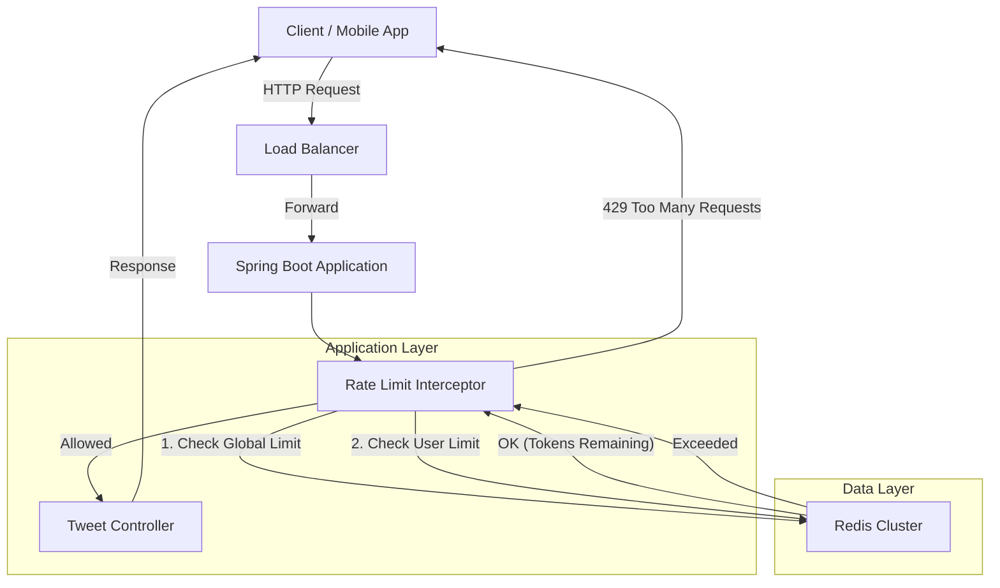

# High-Level Design (HLD)

## Problem Statement
Implement a production-ready rate limiting system for a Twitter/X-style platform that:
1.  **Prevents Abuse**: Stops global DDoS or massive spam.
2.  **Handles Viral Spikes**: Allows legitimate users to "burst" (post rapidly for a short time) without being blocked, while maintaining a long-term steady rate.
3.  **Differentiates Users**: Supports Free vs. Premium tiers.

## Architecture

## Strategy: Token Bucket Algorithm
We use the **Token Bucket** algorithm (via Bucket4j + Redis) because it naturally supports "Bursts".

-   **Bucket Capacity**: The maximum number of tokens a user can accumulate. This defines the **Burst Size**.
-   **Refill Rate**: The speed at which tokens are added back. This defines the **Steady State Rate**.

### Example: "Viral Spike" Scenario
-   **User**: Free Tier
-   **Limit**: 20 requests/hour (Refill), Capacity 5 (Burst).
-   **Scenario**: User sees breaking news.
    -   T=0s: User posts 5 tweets in 2 seconds. -> **ALLOWED** (Bucket empties from 5 to 0).
    -   T=3s: User tries 6th tweet. -> **BLOCKED** (Bucket empty).
    -   T=3min: User tries again. -> **ALLOWED** (Bucket refilled 1 token).

This protects the system from a bot sending 100 req/sec, but lets a human user behave naturally.

## Tiers

| Tier | Burst Capacity | Refill Rate | Use Case |
| :--- | :--- | :--- | :--- |
| **Global System** | 1,000 | 10,000 / min | Abuse prevention (DDoS protection) |
| **Premium User** | 20 | 100 / hour | Paid subscribers |
| **Free User** | 5 | 20 / hour | Standard accounts |
