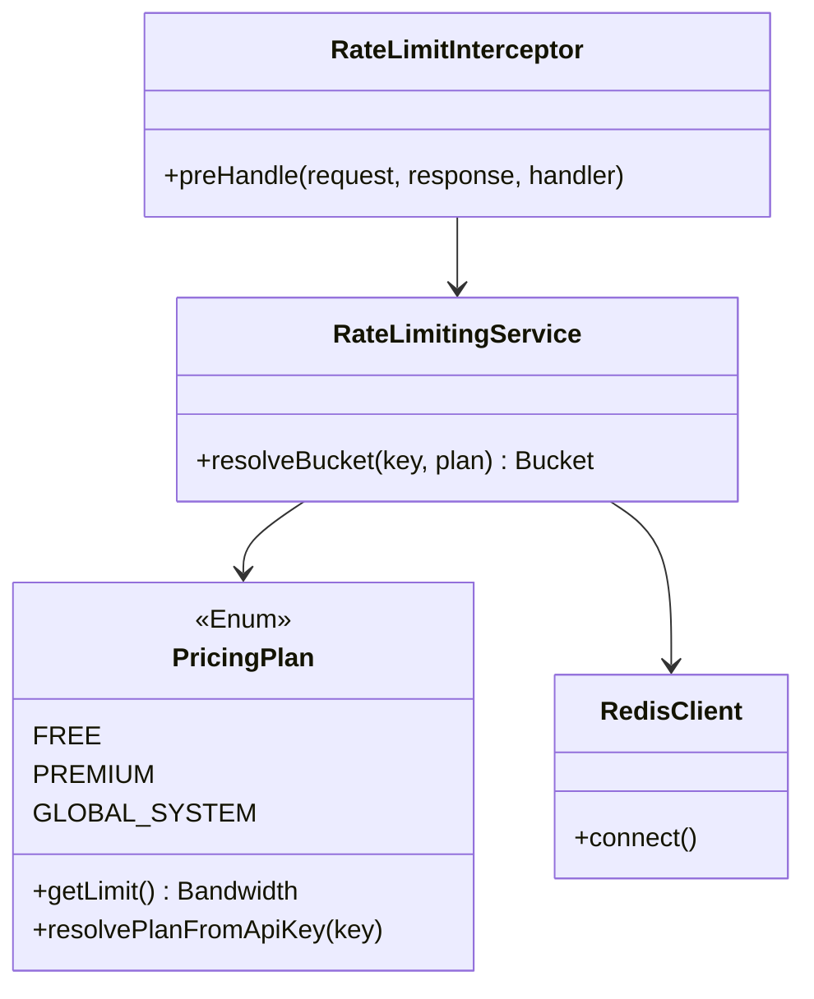

# Low-Level Design (LLD)

## Component Diagram



## Implementation Details

### 1. Storage Key Design
Redis keys are namespaced to avoid collisions:
-   **User Key**: `rate_limit:USER:{apiKey}`
-   **IP Key**: `rate_limit:IP:{ipAddress}`
-   **Global Key**: `rate_limit:GLOBAL_LIMIT`

### 2. Request Flow (Interceptor)
1.  **Global Check**:
    -   Try to consume 1 token from `GLOBAL_LIMIT`.
    -   If failed -> Return `429 System Busy`.
2.  **Identity Resolution**:
    -   Check `X-API-KEY` header.
    -   If present -> Plan = `PREMIUM` (if valid), Key = `USER:{apiKey}`.
    -   If missing -> Plan = `FREE`, Key = `IP:{remoteAddr}`.
3.  **User Check**:
    -   Resolve Bucket for Key + Plan.
    -   Try to consume 1 token.
    -   **Success**: Add `X-Rate-Limit-Remaining` header, proceed.
    -   **Failure**: Calculate `Retry-After` (seconds until next refill), return `429 Too Many Requests`.

### 3. Dependencies
-   **Bucket4j-Redis**: Handles the distributed state management and atomicity using Redis Lua scripts.
-   **Lettuce**: Non-blocking Redis client.

### 4. Configuration
`PricingPlan.java` defines the rules.
```java
FREE(5, 20, Duration.ofHours(1)),
PREMIUM(20, 100, Duration.ofHours(1))
```
Changing these values instantly affects new buckets (existing buckets effectively migrate after expiry/recreation).
