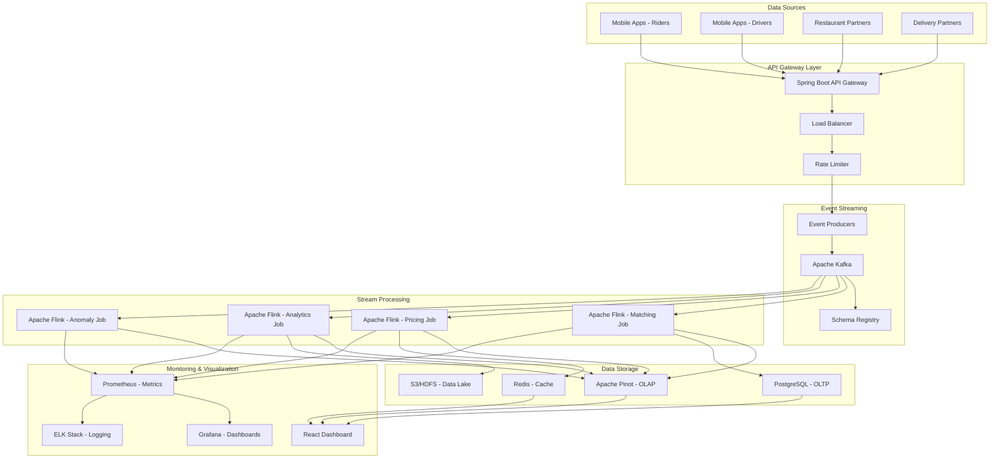

# Uber-Style Real-Time Analytics Architecture

## System Overview

This project implements a comprehensive real-time analytics platform inspired by Uber's architecture, capable of processing millions of events per second with exactly-once semantics and sub-second latency.

## Architecture Diagram



## Core Components

### 1. Event Streaming Layer

#### Apache Kafka
- **Purpose**: High-throughput event streaming platform
- **Configuration**: 
  - 3 brokers for high availability
  - Replication factor: 3
  - Min in-sync replicas: 2
- **Topics**:
  - `ride-events`: Ride lifecycle events
  - `driver-events`: Driver location and status updates
  - `order-events`: Food delivery order events
  - `pricing-updates`: Dynamic pricing changes
  - `matching-results`: Driver-rider matching outcomes

#### Schema Registry
- **Purpose**: Schema evolution and Avro serialization
- **Features**:
  - Backward/forward compatibility
  - Schema versioning
  - Type safety across services

### 2. Stream Processing Layer

#### Apache Flink Jobs

##### Real-Time Matching Job
```java
// Key Features:
- Driver-rider matching algorithm
- Geospatial indexing and proximity search
- Real-time availability tracking
- Optimization for distance, ETA, and driver rating
```

**Processing Flow**:
1. Consume ride requests from Kafka
2. Maintain driver availability state
3. Apply matching algorithm with constraints
4. Publish matching results

**Performance**: 
- Latency: <100ms
- Throughput: 50K matches/second
- State size: 1M active drivers

##### Dynamic Pricing Job
```java
// Key Features:
- Supply/demand ratio calculation
- Geohash-based spatial partitioning
- Surge pricing algorithm
- Real-time price updates
```

**Processing Flow**:
1. Aggregate demand by location (5-minute windows)
2. Aggregate supply by location (5-minute windows)
3. Calculate demand/supply ratio
4. Apply surge pricing algorithm
5. Publish pricing updates

**Surge Algorithm**:
```
surge_multiplier = max(1.0, min(5.0, demand_ratio * base_multiplier))
where demand_ratio = demand_count / supply_count
```

##### Analytics Aggregation Job
```java
// Key Features:
- Real-time KPI calculation
- Multi-dimensional aggregations
- Exactly-once processing
- Windowed computations
```

**Metrics Computed**:
- Rides per minute by city
- Average trip duration
- Revenue per hour
- Driver utilization rates
- Customer satisfaction scores

##### Anomaly Detection Job
```java
// Key Features:
- Statistical anomaly detection
- Complex Event Processing (CEP)
- Fraud pattern recognition
- System health monitoring
```

**Detection Patterns**:
- Unusual ride patterns (distance/duration)
- Suspicious cancellation behavior
- Driver fraud patterns
- System performance anomalies

### 3. Data Storage Layer

#### Apache Pinot (OLAP)
- **Purpose**: Real-time analytics queries
- **Features**:
  - Sub-second query latency
  - Columnar storage
  - Real-time ingestion from Kafka
  - Distributed query processing

**Table Schemas**:
```sql
-- Ride Analytics Table
CREATE TABLE ride_analytics (
    ride_id VARCHAR,
    city VARCHAR,
    ride_type VARCHAR,
    timestamp TIMESTAMP,
    duration_minutes INT,
    distance_km DOUBLE,
    fare_amount DOUBLE,
    surge_multiplier DOUBLE,
    driver_rating DOUBLE,
    rider_rating DOUBLE
) WITH (
    PARTITION BY city,
    ORDER BY timestamp DESC
);
```

#### PostgreSQL (OLTP)
- **Purpose**: Transactional data storage
- **Features**:
  - ACID compliance
  - Complex queries
  - Referential integrity
  - Connection pooling

#### Redis (Cache)
- **Purpose**: High-speed caching and session management
- **Use Cases**:
  - Driver location cache
  - Pricing cache
  - Session management
  - Rate limiting counters

### 4. Monitoring & Observability

#### Prometheus + Grafana
- **Metrics Collection**:
  - Flink job metrics
  - Kafka throughput
  - Application metrics
  - Infrastructure metrics

#### ELK Stack
- **Log Aggregation**:
  - Application logs
  - System logs
  - Error tracking
  - Performance monitoring

## Data Flow Architecture

### 1. Event Ingestion Flow
```
Mobile App → API Gateway → Event Producer → Kafka → Flink Jobs
```

### 2. Real-Time Processing Flow
```
Kafka Topics → Flink Stream Processing → State Management → Output Sinks
```

### 3. Analytics Query Flow
```
Dashboard → Pinot Broker → Pinot Server → Query Results
```

## Scalability Design

### Horizontal Scaling
- **Kafka**: Add brokers and increase partitions
- **Flink**: Increase parallelism and task managers
- **Pinot**: Add servers and brokers
- **API Gateway**: Load balancer with multiple instances

### Vertical Scaling
- **Memory**: Increase heap size for Flink jobs
- **CPU**: More cores for parallel processing
- **Storage**: SSD for faster I/O operations

## Fault Tolerance

### Exactly-Once Processing
- **Kafka**: Idempotent producers and transactional consumers
- **Flink**: Checkpointing with RocksDB state backend
- **Pinot**: Deduplication based on event IDs

### High Availability
- **Multi-AZ Deployment**: Services across availability zones
- **Replication**: Data replicated across nodes
- **Circuit Breakers**: Prevent cascade failures
- **Health Checks**: Automatic failover mechanisms

## Performance Characteristics

### Throughput Benchmarks
| Component | Throughput | Latency |
|-----------|------------|---------|
| Kafka Ingestion | 1M events/sec | <10ms |
| Flink Processing | 500K events/sec | <100ms |
| Pinot Queries | 1K queries/sec | <100ms |
| End-to-End | 100K events/sec | <500ms |

### Resource Requirements
| Service | CPU | Memory | Storage |
|---------|-----|--------|---------|
| Kafka | 4 cores | 8GB | 1TB SSD |
| Flink JobManager | 2 cores | 4GB | 100GB |
| Flink TaskManager | 4 cores | 8GB | 200GB |
| Pinot Controller | 2 cores | 4GB | 100GB |
| Pinot Server | 4 cores | 16GB | 500GB SSD |

## Security Architecture

### Authentication & Authorization
- **JWT Tokens**: Stateless authentication
- **Role-Based Access**: Fine-grained permissions
- **API Keys**: Service-to-service authentication

### Data Protection
- **Encryption in Transit**: TLS 1.3 for all communications
- **Encryption at Rest**: AES-256 for stored data
- **PII Masking**: Sensitive data anonymization

### Network Security
- **VPC**: Isolated network environment
- **Security Groups**: Firewall rules
- **Private Subnets**: Internal service communication

## Deployment Architecture

### Kubernetes Deployment
```yaml
# Example deployment configuration
apiVersion: apps/v1
kind: Deployment
metadata:
  name: flink-jobmanager
spec:
  replicas: 1
  selector:
    matchLabels:
      app: flink-jobmanager
  template:
    spec:
      containers:
      - name: jobmanager
        image: flink:1.18.0
        resources:
          requests:
            memory: "1Gi"
            cpu: "500m"
          limits:
            memory: "2Gi"
            cpu: "1000m"
```

### Infrastructure as Code
- **Terraform**: Infrastructure provisioning
- **Helm Charts**: Kubernetes application deployment
- **GitOps**: Automated deployment pipeline

## Disaster Recovery

### Backup Strategy
- **Kafka**: Topic replication across regions
- **Flink**: Savepoints for job recovery
- **Pinot**: Deep store backup to S3
- **PostgreSQL**: Continuous WAL archiving

### Recovery Procedures
- **RTO**: Recovery Time Objective < 15 minutes
- **RPO**: Recovery Point Objective < 5 minutes
- **Automated Failover**: Cross-region deployment
- **Data Consistency**: Eventual consistency model

## Cost Optimization

### Resource Optimization
- **Auto-scaling**: Dynamic resource allocation
- **Spot Instances**: Cost-effective compute
- **Data Tiering**: Hot/warm/cold storage strategy
- **Compression**: Reduce storage and network costs

### Monitoring & Alerting
- **Cost Tracking**: Per-service cost allocation
- **Budget Alerts**: Prevent cost overruns
- **Resource Utilization**: Optimize underused resources

This architecture provides a robust, scalable, and cost-effective platform for real-time analytics at Uber scale, capable of handling millions of events per second while maintaining sub-second query latency and exactly-once processing guarantees.